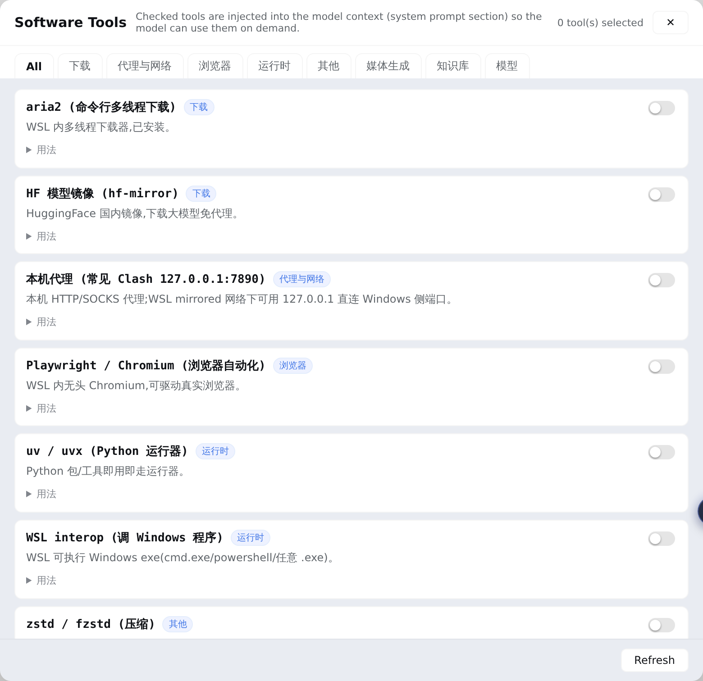

# dsh-software-tools

Sidebar **🔧 软件工具** manager for [DeepSeek Harness](https://github.com/deepseek-ai/deepseek-harness) Web. Maintain a curated inventory of local software — WSL CLI tools and Windows apps reachable via interop — and check the ones you want the model to know about. The checked set is injected into the model's system prompt as a compact section, so every session knows what software exists on this machine and how to call it. 中文说明见 [README.zh.md](README.zh.md)。



## Problem

A model (e.g. deepseek-v4-flash) has no idea that you have IDM, ComfyUI, Obsidian, aria2… installed, let alone how to invoke each one. This plugin turns "local software inventory + invocation recipes" into a **checkable, persisted, auto-injected** system-prompt section: the model reads the `usage` field and runs the ready-made command.

## Features

| | Capability | Detail |
| --- | --- | --- |
| 🔧 | Sidebar panel | Tools grouped by category; toggling takes effect on the model's very next request — no restart |
| 📥 | Built-in + user catalog merge | Portable built-in catalog (aria2 / proxy / playwright / uvx / interop / zstd …); user entries in `catalog.json` override built-ins by id |
| 🧠 | System-prompt injection | Checked tools become a compact section on every assembly (`systemPrompt.section`, same seam as persona / plan-mode) |
| 🛠 | Bundled skill | Ships `add-software-tool`: the model learns to write newly installed software into the user catalog — no rebuild, no restart |
| 🔒 | Loopback RPC | Panel ↔ host over a loopback-pinned RPC channel; reads local JSON only |

## Install

```bash
dsh plugin --profile web add dsh-software-tools
```

If your pnpm supply-chain policy blocks `dsh plugin add`, install manually: copy the package into `~/.dsh/profiles/web/node_modules/` and append to `~/.dsh/profiles/web/cordis.patch.yml`:

```yaml
- insert:
    - id: dsh-software-tools
      name: dsh-software-tools
      config: {}
- insert:
    - id: software-tools-skill
      name: '@deepseek-ai/dsh-skill-filesystem'
      config:
        providerName: software-tools-skill
        includeDefaultRoots: false
        customSkillDirs:
          - !!js process.getBuiltinModule('node:path').join(process.getBuiltinModule('node:path').dirname(process.getBuiltinModule('node:module').createRequire(baseUrl).resolve('dsh-software-tools/package.json')), 'skills')
```

Restart `dsh web` and hard-refresh (Ctrl+Shift+R). A **🔧 软件工具** entry appears in the sidebar.

## Configuration

All optional; zero-config by default:

| Field | Default | Meaning |
| --- | --- | --- |
| `settingsDir` | `$DSH_HOME/software-tools` | State directory holding `selection.json` + `catalog.json` |

## State files

| File | Purpose |
| --- | --- |
| `<settingsDir>/selection.json` | `{"ids": ["aria2", …]}` — current selection |
| `<settingsDir>/catalog.json` | `{"tools": [entry…]}` — user catalog; same id overrides a built-in |

Entry fields: `id` (`[a-z0-9-]{1,32}`, unique), `name`, `category` (`download`/`proxy`/`media`/`browser`/`knowledge`/`runtime`/`model`/`misc`), `desc` (≤40 chars), `usage` (1–2 actionable, directly executable lines).

## Adding a tool

Tell the model "add XXX to 软件工具" — the bundled `add-software-tool` skill researches the software and writes it into `catalog.json` (no rebuild, no restart; visible on panel refresh). You can also edit `catalog.json` by hand.

## How it works

- **Host half** (`src/index.ts`): registers `systemPrompt.section` (`software-tools`, order 200) rendered from the current selection, plus the loopback RPC channel `/ _dsh-software-tools` (`list` / `set`).
- **Browser half** (`src/client/`): DOM-injected sidebar entry + panel (same selector pattern as the linxin666 plugin family), built by `tsdown` into a lazy-CJS `__ModuleLoader__` bundle (React comes from the host shell).
- **Skill** (`skills/add-software-tool/`): mounted via `dsh-skill-filesystem`'s `customSkillDirs`, scoped to the plugin's own directory so user skill roots stay untouched.

## License

[MIT](LICENSE)
